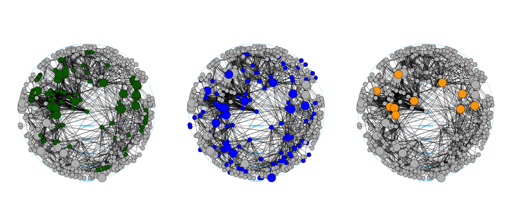

# Collaboration networks in the Hungarian film industry

###### This is a public repository for the article

Juhász, S.; Tóth, G. and Lengyel, B. (2019): Brokering the core and the periphery - creative success and collaboration networks in the film industry. *PLOS One*, -In Press-

[Abstract]
*In collaboration-based creative industries, such as film production, creators in the network core enjoy prestige and legitimacy that are key for creative success. However, core creators are challenged to maintain diverse access to new ideas or alternative views that often emerge from the network periphery. In this paper, we demonstrate that creators in the network core can increase the probability of their creative success by brokering peripheral collaborators to the core. The argument is tested on a dynamic collaboration network of movie creators constructed from a unique dataset of Hungarian feature films for the 1990-2009 period. We propose a new way to capture brokers’ role in core/periphery networks and provide evidence that being in the core and at the same time bridging between the core and the periphery of the network significantly increases the likelihood of award winning.*  

*https://journals.plos.org/plosone/article?id=10.1371/journal.pone.0229436*  

## Scripts  

file: *datacollection-single-film-page.ipynb* 
It collects data on title, production year, cinematographers, directors, editors, producers and writers of a single movie from the Hungarian Film Archive online database.  

file: *datacollection-all-movies-by-year.ipynb* 
It collects data on title, production year, cinematographers, directors, editors, producers and writers of all movies produced in a year from the Hungarian Film Archive online database.  

file: *datacollection-entire-film-archive.ipynb* 
It collects data on title, production year, cinematographers, directors, editors, producers and writers of all movies listed in the Hungarian Film Archive online database.  

file: *datacollection-entire-film-archive.py*  
Easy to run .py script to collect all the available data from the Hungarian Film Archive online database.  

file: *network-visuals.R*  
It constructs and visualizes the collaboration network of movie creators in 2006 (see below).  

## Data  

The data folder contains two datasets about Hungarian feature films, their creators and their awards at the Hungarian Film Week in 1975-2010. Datasets were constructed on the bases of the Hungarian Film Archive *http://mandarchiv.hu/tart/jatekfilm* and the Hungarian Film Yearbooks *https://filmarchiv.hu/hu/tudastar/kiadvany-archivum/filmevkonyv*. Both datasets are anonymized and only used for the purpose of the research paper above.  

file: *creator_movie_BASE_1975_2010.csv*  
Dataset on feature films, their production year and their creators (cinematographers, directors, editors, producers and writers), in 1975-2010. Collected and anonymized in 2017. 

file: *award_winners.csv*  
Dataset only on award winning feature film creators in 1976-2009. For award winning both individual and best picture categories are considered at the Hugnarian Film Weeks. 

## Figures  
The figure below captures the collaboration network of movie creators on Hungarian feature films in 2006. The network is based on a 7-year moving window, where nodes represent movie creators and edges represent collaboration on all movies made between 2000 and 2006. Nodes with a higher degree of centrality are closer to the center of the circular layout.  Uniformly large nodes represent award winners in all three graphs. Colours of the nodes show their special positions as Core, Broker and Core & Broker & Award winner creators. The layout is created by the graphlayouts R package.  
link: *https://github.com/schochastics/graphlayouts* 
 
 

